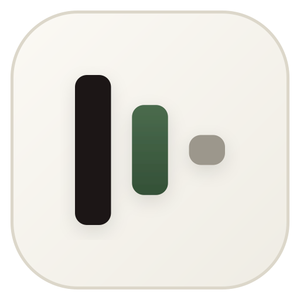

# VITL Piano Desktop (Autoplayer & High-Fidelity Synthesizer)

<div align="center">
  
  <h3>Modern, Ultra-Low Latency Piano Autoplayer & Audio Synthesizer in Rust</h3>
  <p>Engineered from A to Z in Rust for Virtual Piano, Roblox, and MIDI lovers.</p>
</div>

---

## 🌟 Key Features

### 1. 🎹 Pure Rust Audio Synthesizer (Zero-Dependency)
- **Physical Modeling & Harmonic Timbre Engine**: Generates acoustic grand piano sound with realistic string inharmonicity stiffness dispersion ($f_k = k \cdot f_0 \sqrt{1 + B k^2}$), velocity-dependent spectral tilt, and hammer strike transients.
- **Polyphonic Voice Allocation**: 128 dynamic voices with smart click-free voice stealing.
- **Damper Pedal Resonance (CC64)**: Realistic sustain pedal resonance.
- **Studio DSP**: Algorithmic stereo Schroeder/Freeverb room reverb with soft-knee saturation limiter to prevent digital clipping.
- **Low-Latency Streaming**: Powered by `cpal` (PipeWire / ALSA / PulseAudio / WASAPI / CoreAudio).
- **Offline WAV Exporter**: Render songs directly to 16-bit 44.1kHz stereo `.wav` audio.

### 2. ⚡ High-Precision Autoplayer & Humanizer
- **Microsecond Accurate Timing**: Zero-drift high-resolution delta scheduler (`Instant`).
- **Flam / Strumming Chord Delays**: Avoids instantaneous unnatural key strikes by spacing chord notes (5ms - 25ms).
- **Micro-Timing Jitter**: Configurable natural timing jitter ($\pm$0-50ms).
- **Velocity Humanization**: Dynamic variation per note.
- **Realistic Mistake Simulation**: Optional adjacent key slip and instant recovery.
- **Finger Count Limiter**: Simulates realistic human hands (10-11 fingers).

### 3. ⌨️ Input Simulation & Virtual Piano Mapping
- **61-Key Virtual Piano Layout**: Full mapping (MIDI 36 to 96 $\to$ `1` to `m` with Shift modifiers).
- **88-Key Extended Range**: Low notes (MIDI 21-35 $\to$ `Ctrl+1`..`Ctrl+t`) and high notes (MIDI 97-108 $\to$ `Ctrl+y`..`Ctrl+j`).
- **Keyboard Layouts Supported**: US QWERTY, AZERTY (French), QWERTZ (German), Dvorak.
- **Game Window Auto-Focus**: Automatically searches and focuses target windows (e.g. Roblox Player).
- **Global Hotkeys**: Control playback (`F1` Play/Pause, `F2` Pause, `F3` Stop, `F4`/`→` Speed Up, `F5`/`←` Slow Down) globally in the background.

### 4. 🎼 Sheet & MIDI Formats
- **Virtual Piano Sheet Parser**: Reads `[159y] [260u]`, `{chords}`, bar delimiters `|`, rests, and BPM notations.
- **MIDI Parser & Serializer**: Full SMF Format 0 and Format 1 support.
- **Intelligent Transposition Optimizer**: Automatically calculates the optimal key transposition (-24 to +24 semitones) for 100% playable notes within 61 or 88 keys.

### 5. 🌐 nanoMIDI Online Hub Integration
- Integrated client for `https://api.nanomidi.net/api/midiData`.
- Live search by title, artist, or uploader.
- Instant download and streaming into the local library (`~/.vitl-piano/midis/`).

### 6. 🎨 High-End LiquidGlass GUI & WebSocket IPC
- Real-time bidirectional WebSocket IPC server (`127.0.0.1:4242`).
- Interactive 88-key piano visualizer showing live active notes.
- LiquidGlass warm paper UI design with moss green accents.

---

## 🚀 Quick Start

### Build & Run
```bash
# Build optimized release binary
cargo build --release

# Run with interactive GUI desktop
./target/release/vitl-piano-desktop

# Run with a specific file immediately
./target/release/vitl-piano-desktop --file samples/fur_elise.mid

# Run on custom port
./target/release/vitl-piano-desktop --port 5000
```

### Run Tests
```bash
cargo test
```

---

## 📁 Project Structure

```
vitl-piano-desktop/
├── Cargo.toml                  # Project dependencies (cpal, midly, rdev, axum, tokio, etc.)
├── desktop.html                # LiquidGlass Desktop GUI & Interactive Piano
├── src/
│   ├── main.rs                 # CLI entry point, server launcher, hotkey dispatcher
│   ├── lib.rs                  # Library crate root
│   ├── core/                   # Core MIDI, Sheet, Song models, Transposition, Config
│   │   ├── config.rs           # App configuration & JSON persistence
│   │   ├── midi.rs             # MIDI file parser & writer
│   │   ├── sheet.rs            # Virtual Piano sheet converter & parser
│   │   ├── song.rs             # Unified Song & NoteEvent models
│   │   └── transposition.rs    # Auto-transposition range optimizer
│   ├── synth/                  # Pure Rust Synthesizer & Audio DSP
│   │   ├── audio_output.rs     # cpal audio stream manager & WAV exporter
│   │   ├── dsp.rs              # Freeverb algorithmic reverb & soft limiter
│   │   └── engine.rs           # 128-voice acoustic piano physical synthesizer
│   ├── player/                 # Playback scheduling & humanization
│   │   ├── engine.rs           # High precision player engine
│   │   └── humanizer.rs        # Flam delay, timing jitter, mistake engine
│   ├── input/                  # Input mapping & OS simulation
│   │   ├── hotkeys.rs          # Background global hotkey listener
│   │   ├── mapping.rs          # 61/88 key & keyboard layout mapper
│   │   └── simulator.rs        # Cross-platform OS key input simulator
│   ├── midi_io/                # Hardware MIDI input / output
│   └── hub/                    # nanoMIDI API client & local library manager
├── samples/                    # Included sample songs (Fur Elise, Rush E, Canon in D)
└── tests/                      # Unit & integration tests
```

---

## 🎹 Global Hotkey Controls

| Hotkey | Action |
|--------|--------|
| `F1` | Play / Pause toggle |
| `F2` | Pause |
| `F3` | Stop |
| `F4` / `→` | Speed up (+10%) |
| `F5` / `←` | Slow down (-10%) |
| `Ctrl + ↑` | Transpose up (+1 semitone) |
| `Ctrl + ↓` | Transpose down (-1 semitone) |

---

## 📜 License
MIT License - VITL Piano Team.
